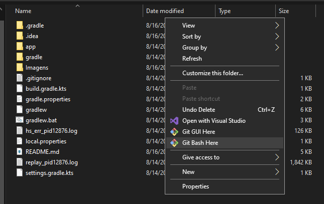
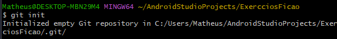
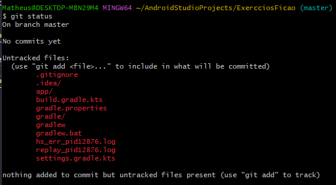
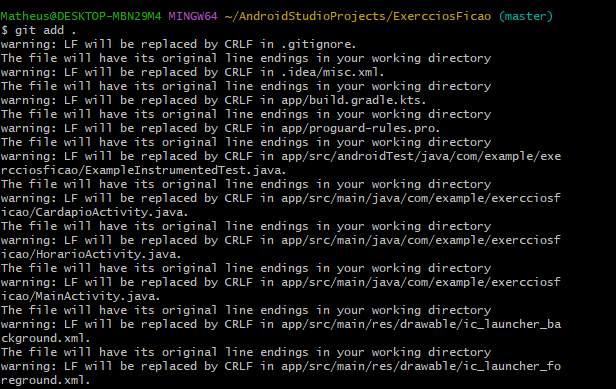
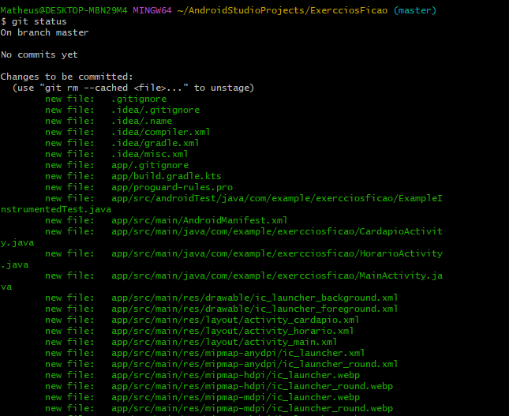
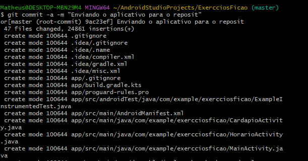
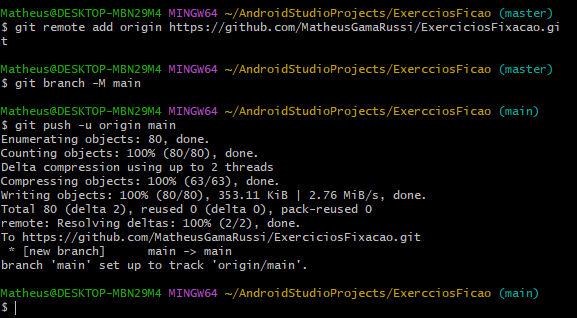

<h1 align="center">Exercícios de Fixação</h1>

<h3 align="center">Nomes: Matheus Gama Russi | Yasmim Pereira da Costa</h3>
<h3 align="center">Link para vídeo de demonstração do App: https://youtu.be/zeGmLNs2qLA</h3>

<h1>Relatório:</h1>
<h2>Criação</h2>

    O projeto teve seu inicio no dia 14 de Agosto de 2023, onde foi decidido o preset utilizado, a linguagem de programação para a aplicação e a versão mínima do Android que ele pode rodar.
 
 
    
 
 
    
 
 
    Como mostrado nas imagens, usamos o preset "Empty Views Activity" para começarmos em uma tela em branco, ficando mais fácil a criação dos layouts. A linguagem de programação escolhida foi o Java, e a versão mínima foi a Android 8.0, conhecida como Versão Oreo.

 
 
<h2>Por dentro do Aplicativo</h2>

    &nbsp &nbsp &nbsp No dia seguinte, dia 14 de Agosto de 2023, se deu inicio ao desenvolvimento do aplicativo de fato.
     
    &nbsp &nbsp &nbsp Os exercícios escolhidos pela dupla foram os exercícios 4 e 6, e a primeira coisa feita, foi uma tela de início, onde o usuário pode escolher qual exercício ele vai olhar.
 
    <h3>Main Activity Layout</h3>
    

    &nbsp &nbsp &nbsp Acima está o layout da tela principal, simples e intuitiva. Apenas com um título para fins de design, e botões que levam para as telas dos exercícios 4 e 6 respectivamente.
 
    <h3>Main Activity Java</h3>
    

    &nbsp &nbsp &nbsp Agora na parte dos códigos, nada de mais também, temos duas funções contento uma Intent Explícita em cada uma, levando para a tela dos exercícios especificados
 
 
    <h2>Exercício 4 - Horário</h2>
    &nbsp &nbsp &nbsp O exercício 4 fala que o aplicativo tem que receber um horário qualquer, e ele vai adicionar 6 horas para esse horário.
 
    <h3>Exercício 4 Layout</h3>
    

    &nbsp &nbsp &nbsp Aqui podemos ver algumas coisas. Temos um título indicando que estamos no exercício 4, após, temos uma mensagem de instruções que diz "Digite abaixo um número entre 0 e 24", abaixo, o campo para o usuário digitar, seguido de um botão escrito "calcular" e um texto escrito "Horário de saida é:" que é onde o resultado será apresentado para o usuário.
 
    <h3>Exercício 4 Java</h3>
    &nbsp &nbsp &nbsp Separando o código em duas partes, temos:
    

    &nbsp &nbsp &nbsp Aqui, declaramos e preenchemos as variáveis necessarias no decorrer do app. Todos eles estão referenciando um elemento em específico do layout, sendo que o "inputTime" referencia o campo onde o usuário escreve, o "calculateButton" referencia o botão de calculo e o "outputTime" referencia o texto que apresenta o resultado para o usuário.
 
    

    &nbsp &nbsp &nbsp Na segunda e última parte do código, temos a parte do funcionamento em si. Usamos o evento de "setOnClickListener" junto do método "onClick" para que tudo o que tiver dentro ser executado assim que o botão for pressionado.
     
    &nbsp &nbsp &nbsp Dentro do método "onClick", começamos com uma condicional verificando se o campo está vazio, caso a condição seja verdadeira, uma mensagem Toast é criada, alertando o usuário para preenchê-lo, e caso a condição seja falsa, vamos em direção ao calculo.
     
    &nbsp &nbsp &nbsp Inicialmente, cria-se duas variáveis, a primeira é o "inputTimeString" que recebe o que foi digitado no campo, e a outra é a "inputTime" que recebe a inputTimeString. A seguir cria-se outra variavel chamada "ot" (abreviação para outputTime) que vai receber o calculo, e por fim a variavel outputTime recebe o valor de ot convertido para string.
 
 
    <h2>Exercício 6 - Cardápio</h2>
    &nbsp &nbsp &nbsp O exercício 6 nos dá uma tabela com 3 produtos, Cachorro Quente, Refrigerante e Sobremesa, com seus respectívos preços, o objetivo é que o aplicativo seja capaz de deixar o usuário escolher quanto de cada produto ele quer, para no final, o aplicativo mostrará quanto ficará o preço total do pedido.
 
    <h3>Exercício 6 Layout</h3>
    

    &nbsp &nbsp &nbsp Na tela do exercício 6, nos deparamos com um título indicando que estamos no exercício 6, os produtos mencionados anteriormente, bem como seus preços individuais por unidade, e um campo onde o usuário digita a quantidade que quer de determinado produto. 
     
    &nbsp &nbsp &nbsp Abaixo há um botão escrito "Calcular" para fazer o calculo do preço final, esse que será apresentado para o usuário onde está escrito "Total do pedido:".
 
    <h3>Exercício 6 Java</h3>
    Vamos separar o código em três partes principais.
    

    No início do código, declaramos as variaveis necessárias para o funcionamento do aplicativo.
 
    

    &nbsp &nbsp &nbsp No método onCreate, método que é chamado sempre quando a tela se inicia, nós preenchemos as variáveis com seus respectívos valores. 
     
    &nbsp &nbsp &nbsp As variáveis "cPreco", "rPreco" e "sPreco" são as variáveis que recebem o preço individual unitário de cada produto, sendo "c" para Cachorro Quente, "r" para Refrigerante e "s" para Sobremesa.  
    &nbsp &nbsp &nbsp As váriaveis "cQtd", "rQtd", "sQtd" e "total" referenciam as views de EditText e TextViews inseridas anteriormente no layout, já que vamos utilizá-las no código.
    

    &nbsp &nbsp &nbsp No fim, temos a parte lógica do código. Aqui, temos dois métodos, vamos começar pelo "calcularTotal".
     
    &nbsp &nbsp &nbsp No método "calcularTotal" fazemos toda a lógica do calculo. Perceba o tipo dele, se trata de um método do tipo "float". Dentro do método, começamos com uma condicional que checa se os meus campos no Layout estão vazios, se essa condição for verdadeira, crio uma mensagem Toast contentdo "Por favor, preencha os campos acima" alertando o usuário para preencher todos eles, e caso a condição for falsa, vamos para a parte do calculo.
     
    &nbsp &nbsp &nbsp No calculo, declaramos 3 variáveis float que vão receber os valores colocados nos campos exigidos, e convertemos eles para um valor numérico. Em seguida, nossa variável de resultado vai receber o calculo, que é uma multiplicação basica da quantidade de cada produto pelo preço dele, e somamos todos eles, e por fim, retornamos o result.
     
    &nbsp &nbsp &nbsp Quanto ao método "botaoCalcular", dentro dele, a variavel que rerebe a TextView que apresenta o preço final ao usuário recebe o resultado retornado pelo método calcularTotal() convertido para string. Por fim, na propriedade "onClick" do botão do layout, indicamos esse método para que ele funcione apropriadamente.

 
 
<h2>Github</h2>

    &nbsp &nbsp &nbsp Após todo o processo de desenvolvimento do aplicativo, vamos mandá-lo para o Github. Há diversas formas, mas a mais comum de vermos em contextos profissionais é a partir do <b>Git Bash</b>.
     
    &nbsp &nbsp &nbsp Antes de se usar o Git Bash, vamos até a pasta desejada, no caso, a pasta do projeto, clicamos com o botão direito em um local vazio, e escolhemos a opção "Git Bash here"
    

     
    &nbsp &nbsp &nbsp Com o prompt aberto, vamos executar os seguintes códigos:
    <h3>git init</h3>
    

    &nbsp &nbsp &nbsp O <b>git init</b> inicia todos os processos do git para nos liberar seu uso.
    <h3>git status</h3>
    

    &nbsp &nbsp &nbsp O <b>git status</b> nos informa todos qual que é o estado de todos os arquivos do nosso repositório. No caso, todos estão em vermelho, ou seja, não foram "tratados" para o envio para o Github, é ai que entra o próximo código.
    <h3>git add</h3>
    

    &nbsp &nbsp &nbsp O <b>git add</b> adiciona arquivos não "tratados" deixando-os prontos para o envio. Perceba o ponto após o comando, com ele, o comando vai adicionar todos os arquivos para o envio. 
    

    &nbsp &nbsp &nbsp Perceba que agora, os arquivos pendentes que antes estavam em vermelho, agora estão em verde, prontos para o próximo comando.
    <h3>git commit</h3>
    

    &nbsp &nbsp &nbsp O <b>git commit</b> deixa todos os arquivos adicionados pelo git add prontos para o envio. O -a significa que ele vai deixar todos os arquivos prontos, e o -m nos permite escrever uma mensagem de commit, no caso, ela é "Enviando o aplicativo para o reposit".
    <h3>Envio para o repositório do Github</h3>
    

    &nbsp &nbsp &nbsp Após todos os comandos anteriores, quando se cria um repositório vazio no Github, esses 3 comandos aparecem para que você possa linkar o seu repositório local com o do servidor do Github. Respectivamente, eles fazem:
    <ul>
        <li align=justify>
            <b>git remote add origin</b> indica qual o repositório do servidor será linkado com o local pela URL;
        </li>
        <li align=justify>
            <b>git branch -M main</b> indica que todas essas alterações ficarão na branch principal do repositório;
        </li>
        <li align=justify>
            <b>git push</b> Envia todos os arquivos para o repositório do servidor.
        </li>
    </ul>

